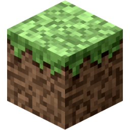
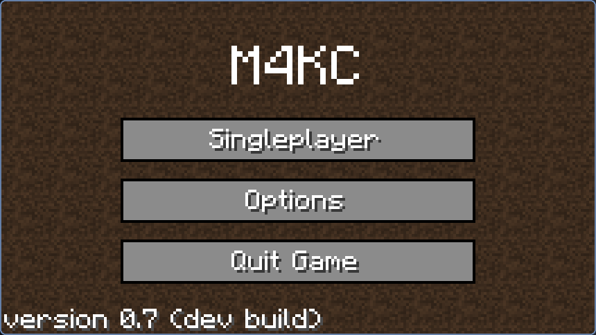
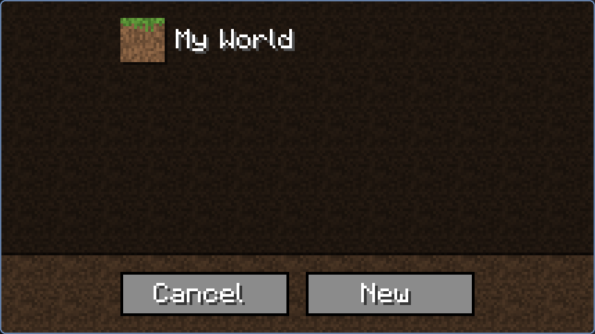

# M4KC

*Minecraft 4K - C Rewrite*

For those who don't know, Minecraft 4K was a stripped down version of Minecraft submitted by Notch to the [Java 4K Game Programming Contest](https://en.wikipedia.org/wiki/Java_4K_Game_Programming_Contest), where each submission had to be under 4 kilobytes in size. Its wiki page can be found [here](https://minecraft.fandom.com/wiki/Minecraft_4k).

Being so small, the game proved somewhat easy to de-compile and edit. [Multiple people have given this a go, including me](https://www.minecraftforum.net/forums/mapping-and-modding-java-edition/minecraft-mods/1290821-minecraft-4k-improved-by-crunchycat-download-now).

This project is an attempt to translate the game into C in order to increase its performance, and to provide a platform upon which to add new features.

## Bug list

* "Sticky" block collision - this behavior is present in the original version and I have been trying to work out ways to fix it for a while.
* Raycaster breaks at -64 along any axis
* Infinite terrain generation is not fully functional, issues such as chunks flashing in and out of existence are common

## Some goals for this project

* Maintaining the original look and feel as closely as possible. ✅️
* Keeping the final executable under 20 KB (on Linux, with the system I have set up in `build.sh`) ✅️
* More blocks 🏗️
* Perlin noise terrain generation ✅️
  * Water 🏗️
  * Biomes 🏗️
  * Caves ✅️
* Infinite worlds, horizontally and vertically too 🏗️
* Mobs and multiplayer (this would require changing the rendering engine to some degree) 🏗️
* Day/night ✅️

*✅️ - got that!*

*🏗️ - not yet...*

## Dependencies

### Bare minimum to make this code run
* SDL2
* A C compiler, such as gcc or clang

### To get it down to a small size, you need
* gzexe

### On windows, you will need
* Mingw-w64 installed

## Build instructions

### Linux, unix, etc
* To just get a binary, run `./build.sh small` or `./build.sh all small`
* To run an uncompressed version, run `./build.sh` or `./build.sh all`
* To install the program, run `./build.sh install`
* To uninstall, run `./build.sh uninstall`
* To clean, run `./build.sh clean`

### Windows
!!! NOTE !!! This doesn't work anymore. updated Windows build system coming soon.

Run `win-build.bat`. Inside of the `win` directory, you will find `m4kc.exe` and `SDL2.dll`. In order for `m4kc.exe` to run, these two must be in the same folder.

## Places

There is a forum thread for this project [here](https://www.minecraftforum.net/forums/mapping-and-modding-java-edition/minecraft-mods/3081789-minecraft-4k-c-rewrite)

I will be uploading binaries [here](https://holanet.xyz/soft/m4kc/)

## FAQ

I've either been asked these, or I expect to be at some point.

> What's with the cryptic variable names like `f22` and `i6`?

A lot of this code is decompiled from the original java version, and those are names the compiler assigned to the variables.

> Why is it so slow?

The game uses a 3D voxel raycaster to render things, which is a lot slower than more traditional methods of rendering. Luckily, C provides more powerful ways to optimize something like this than Java - and optimizations will keep coming.

## Screenshots

What this actually looks like.

